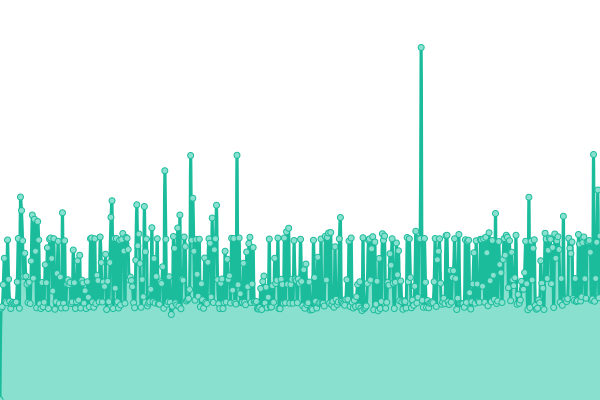
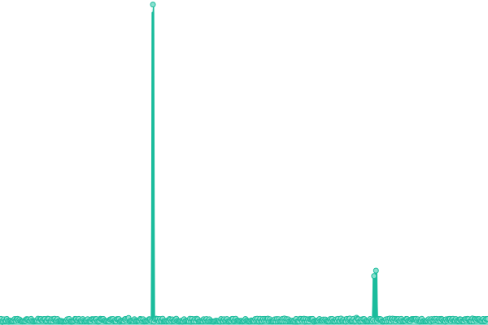
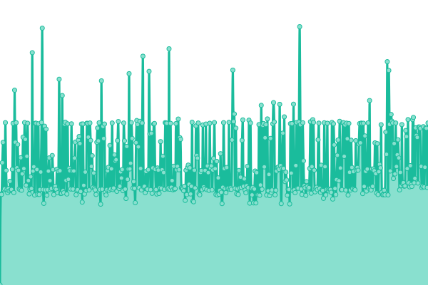
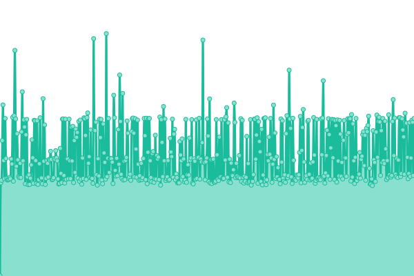

# [📈 Live Status](https://demo.upptime.js.org): <!--live status--> **🟩 All systems operational**

This repository contains the open-source uptime monitor and status page for [Stach Redeker](www.stachredeker.nl), powered by [Upptime](https://github.com/upptime/upptime).

With [Upptime](https://upptime.js.org), you can get your own unlimited and free uptime monitor and status page, powered entirely by a GitHub repository. We use [Issues](https://github.com/StachRedeker/uptime/issues) as incident reports, [Actions](https://github.com/StachRedeker/uptime/actions) as uptime monitors, and [Pages](https://demo.upptime.js.org) for the status page.

<!--start: status pages-->
<!-- This summary is generated by Upptime (https://github.com/upptime/upptime) -->
<!-- Do not edit this manually, your changes will be overwritten -->
<!-- prettier-ignore -->
| URL | Status | History | Response Time | Uptime |
| --- | ------ | ------- | ------------- | ------ |
|  [Productieserver - s243](https://s243.webhostingserver.nl) | 🟩 Up | [productieserver-s243.yml](https://github.com/StachRedeker/uptime/commits/HEAD/history/productieserver-s243.yml) | 

 514ms
     
 | 

<a href="https://status.studiostach.nl/history/productieserver-s243">100.00%</a>
    

|  [Developmentserver - h22](5.254.117.215) | 🟩 Up | [developmentserver-h22.yml](https://github.com/StachRedeker/uptime/commits/HEAD/history/developmentserver-h22.yml) | 

 424ms
     
 | 

<a href="https://status.studiostach.nl/history/developmentserver-h22">88.98%</a>
    

|  [Studio Stach Homepage](https://www.studiostach.nl/) | 🟩 Up | [studio-stach-homepage.yml](https://github.com/StachRedeker/uptime/commits/HEAD/history/studio-stach-homepage.yml) | 

 1070ms
     
 | 

<a href="https://status.studiostach.nl/history/studio-stach-homepage">100.00%</a>
    

|  [Mailserver](https://mail.antagonist.nl/) | 🟩 Up | [mailserver.yml](https://github.com/StachRedeker/uptime/commits/HEAD/history/mailserver.yml) | 

 539ms
     
 | 

<a href="https://status.studiostach.nl/history/mailserver">100.00%</a>
    

<!--end: status pages-->

[**Visit our status website →**](https://demo.upptime.js.org)

## 📄 License

- Powered by: [Upptime](https://github.com/upptime/upptime)
- Code: [MIT](./LICENSE) © [Anand Chowdhary](https://anandchowdhary.com), supported by [Pabio](https://pabio.com)
- Data in the `./history` directory: [Open Database License](https://opendatacommons.org/licenses/odbl/1-0/)
